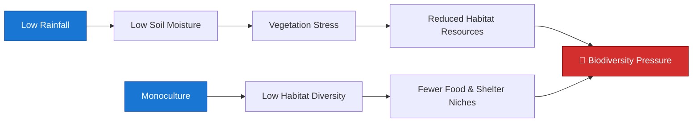
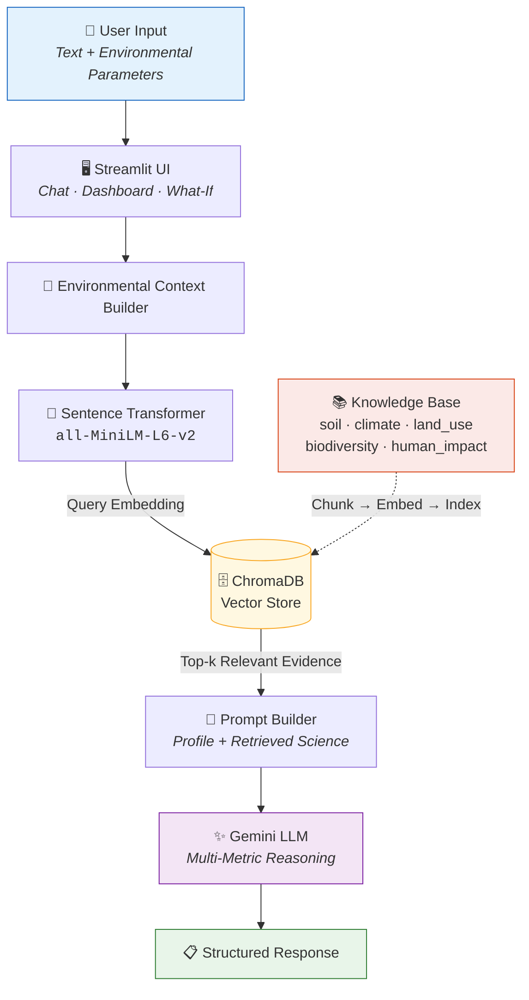
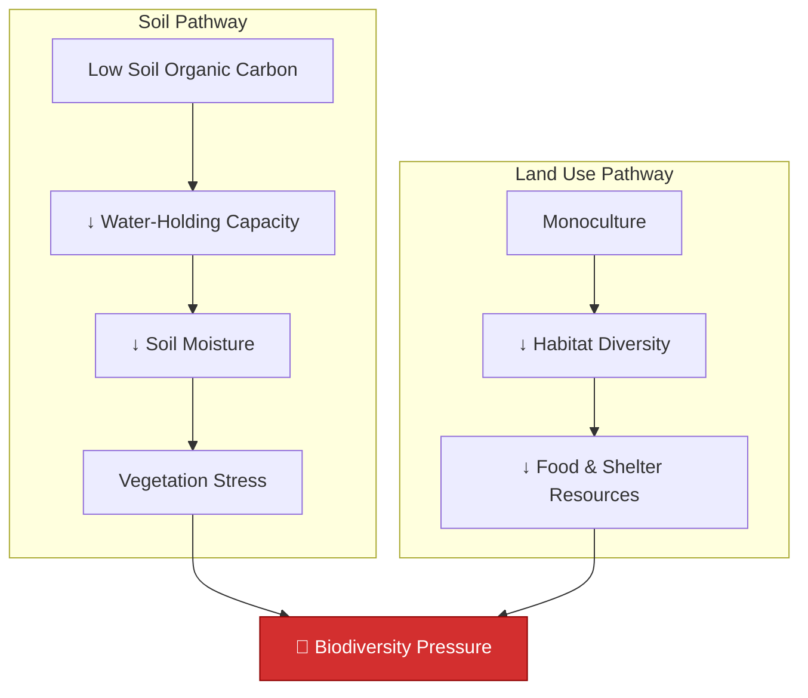
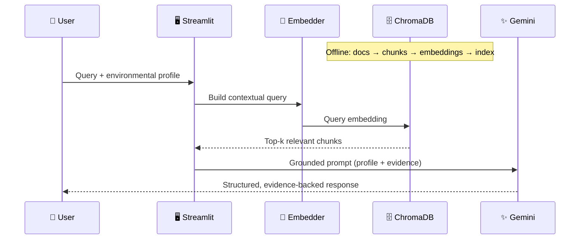
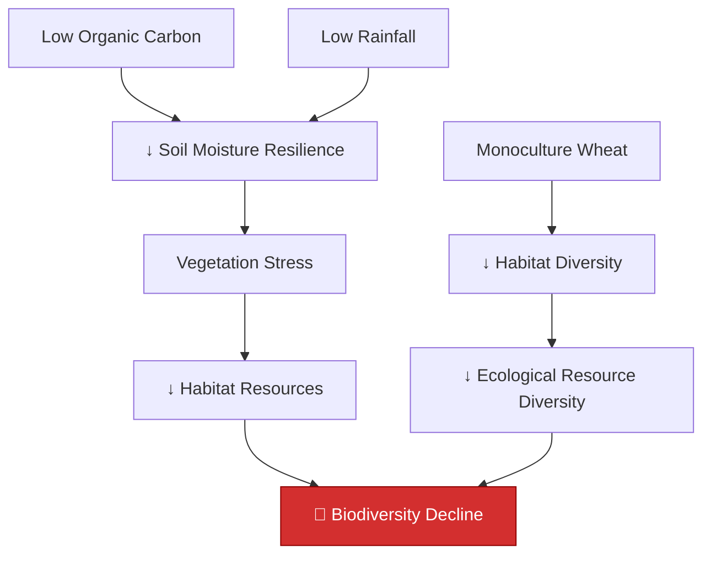
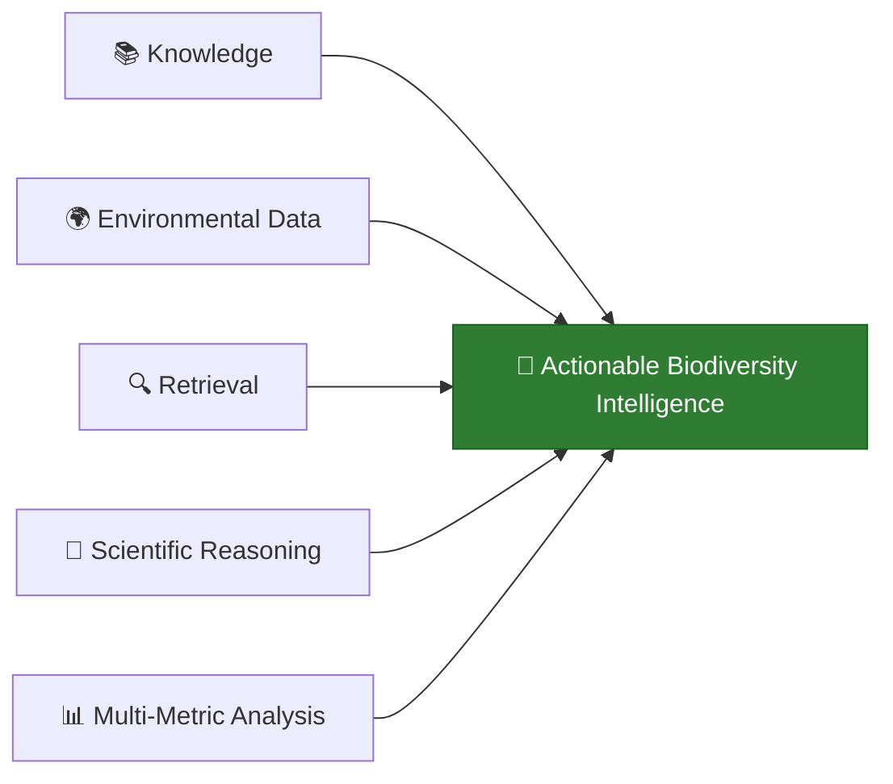

<div align="center">

# 🌿 BioDiversify AI

### *AI-Powered Biodiversity Intelligence & Environmental Decision-Support System*

**Not another chatbot that says "use sustainable practices."**
BioIntel AI reads the science, reads your land, and connects the dots.

<br>

[](https://www.python.org/)
[](https://streamlit.io/)
[](https://ai.google.dev/)
[](https://www.trychroma.com/)

[](#-how-rag-works-here)
[](LICENSE)
[](#%EF%B8%8F-limitations)
[](#-contributing)

<br>

[**Quick Start**](#-quick-start) · [**Architecture**](#%EF%B8%8F-system-architecture) · [**Features**](#-core-features) · [**Demo Query**](#-walkthrough-a-real-query) · [**Roadmap**](#-roadmap)

</div>
---

**Live App:** https://huggingface.co/spaces/Usersak123/BioDiversify-AI

---

## 📖 Table of Contents

<table>
<tr>
<td valign="top" width="33%">

**Understand**
- [Why BioDiversify AI](#-why-biodiversify-ai)
- [What Makes It Different](#-what-makes-it-different)
- [System Architecture](#%EF%B8%8F-system-architecture)
- [How RAG Works Here](#-how-rag-works-here)

</td>
<td valign="top" width="33%">

**Build**
- [Tech Stack](#%EF%B8%8F-tech-stack)
- [Quick Start](#-quick-start)
- [Project Structure](#-project-structure)
- [Data Schemas](#-data-schemas)

</td>
<td valign="top" width="33%">

**Ship**
- [Deployment](#-deployment)
- [CI/CD](#-cicd)
- [Roadmap](#-roadmap)
- [Limitations](#%EF%B8%8F-limitations)

</td>
</tr>
</table>

---

## 🎯 Why BioDiversify AI

Environmental problems are **never single-variable**. Ask a generic LLM why biodiversity is dropping on a farm and you'll get a paragraph of platitudes. The real answer is a *chain*.



BioIntel AI traces these chains explicitly — grounding every step in retrieved scientific evidence rather than model intuition.

### The domains it reasons across

<div align="center">

| 🌱 Soil Health | 💧 Water | 🌦️ Climate | 🌾 Land Use | 🦋 Biodiversity | 🏭 Human Impact |
|:---:|:---:|:---:|:---:|:---:|:---:|
| pH, SOC, moisture | Availability, retention | Rainfall, temperature | Crop systems, cover | Richness, habitat | Pesticides, pollution |

</div>

---

## ⚡ What Makes It Different

<table>
<tr>
<th width="50%">❌ Generic Chatbot</th>
<th width="50%">✅ BioIntel AI</th>
</tr>
<tr>
<td>

> *"Try using sustainable farming practices and consider planting more native species."*

- Single-variable thinking
- No evidence trail
- No timeline or trade-offs
- Same answer for every region

</td>
<td>

> *"Your SOC at 0.3% combined with 400mm rainfall means water-holding capacity is the binding constraint, not species selection…"*

- **Multi-metric causal reasoning**
- **Cited scientific evidence** (FAO, IPBES, UNEP)
- **Short / medium / long-term horizons**
- **Explicit risks & uncertainty**

</td>
</tr>
</table>

### Every response is structured

```
┌─ 🔍 DIAGNOSIS ──────────── What's actually happening
├─ 🧠 REASONING ──────────── The causal chain, variable by variable
├─ ✅ RECOMMENDATIONS ────── Ranked, actionable interventions
├─ 📊 IMPACTED METRICS ───── What will measurably change
├─ ⏳ TIME HORIZON ───────── When to expect results
├─ ⚠️ RISKS & UNCERTAINTY ── Trade-offs and confidence limits
└─ 📚 EVIDENCE ───────────── Retrieved source documents
```

---

## 🏗️ System Architecture



---

## 🧠 Core Features

<details open>
<summary><b>1️⃣ &nbsp;Knowledge-Grounded RAG</b> — the LLM never answers alone</summary>

<br>

Scientific documents are chunked, embedded, and indexed. Every user query pulls the most semantically relevant evidence *before* reasoning begins.

**Knowledge sources include:**

| Source | Coverage |
|---|---|
| 🌍 **FAO** Soil Resources & Global Soil Partnership | Soil chemistry, degradation, management |
| 🌿 **FAO** Biodiversity Resources | Agricultural biodiversity, ecosystem services |
| 🦋 **IPBES** Assessments | Global biodiversity & ecosystem services |
| 🌏 **UNEP** Environmental Assessments | Land degradation, pollution, climate |
| 📄 Peer-reviewed ecological research | Mechanisms, intervention efficacy |

</details>

<details>
<summary><b>2️⃣ &nbsp;Multi-Metric Causal Reasoning</b> — recommendations from the whole picture</summary>

<br>



Because both pathways are modeled, the system proposes interventions that relieve **multiple pressures at once** — e.g. cover cropping raises SOC *and* habitat diversity simultaneously.

</details>

<details>
<summary><b>3️⃣ &nbsp;Conversational Intelligence</b> — asks before it assumes</summary>

<br>

Multi-turn context is preserved via Streamlit session state, and the system actively identifies **missing information** rather than guessing.

```
👤 "My biodiversity is declining."
      ↓
🤖 "To diagnose this properly, I need soil carbon, rainfall,
    land use type, and species observations. What do you have?"
      ↓
👤 "Soil carbon is 0.3% and rainfall is low."
      ↓
🤖 [Retrieves evidence → updates reasoning → full structured assessment]
```

</details>

<details>
<summary><b>4️⃣ &nbsp;What-If Intervention Simulator</b> — test before you dig</summary>

<br>

Evaluate proposed interventions against your current profile:

<div align="center">

| | | |
|---|---|---|
| 🌱 Cover crops | 🌾 Intercropping | 🌳 Agroforestry |
| 🐝 Flowering margins | 🚫 Reduced pesticides | 🔗 Habitat connectivity |
| 🪱 Soil organic matter | 💧 Water retention zones | |

</div>

```
Current Environment + Proposed Intervention
        ↓
Ecological Mechanism → Affected Metrics
        ↓
Short / Medium / Long-Term Effects
        ↓
Trade-offs & Uncertainty
```

</details>

<details>
<summary><b>5️⃣ &nbsp;Environmental Monitoring & Pressure Screening</b></summary>

<br>

**Trackable indicators:** Soil organic carbon (%) · Soil moisture (%) · Soil pH · Species richness · Habitat diversity · Vegetation cover · Pollinator observations · Water availability · Pesticide pressure

**Pressure screening** produces a prototype composite score from: low SOC, low moisture, low rainfall, monoculture, low species richness, low habitat diversity, high pesticide/pollution/habitat-loss pressure.

> ⚠️ **Note:** This is a *prototype screening heuristic*, not a scientifically validated biodiversity index.

</details>

---

## 🔄 How RAG Works Here



<details>
<summary><b>The 10-step pipeline, in detail</b></summary>

<br>

| # | Step | Component |
|:---:|---|---|
| 1 | Load environmental documents | `rag.py` |
| 2 | Split documents into chunks | `rag.py` |
| 3 | Generate embeddings | `all-MiniLM-L6-v2` |
| 4 | Store vectors | ChromaDB |
| 5 | Receive user query | `app.py` |
| 6 | Generate query embedding | Sentence Transformers |
| 7 | Retrieve relevant chunks | ChromaDB similarity search |
| 8 | Combine evidence + environmental profile | Prompt Builder |
| 9 | Send grounded prompt | Gemini API |
| 10 | Generate structured recommendation | Gemini → UI |

</details>

---

## 🗂️ Data Schemas

<details open>
<summary><b>📚 Knowledge Entry</b> (ChromaDB document)</summary>

```json
{
  "id": "soil_0",
  "document": "Soil organic carbon is an important indicator...",
  "metadata": { "source": "soil" },
  "embedding": "[vector representation]"
}
```

**Categories**

| Category | Example Information |
|---|---|
| `soil` | pH, organic carbon, moisture, soil organisms |
| `land_use` | Monoculture, intercropping, agroforestry, connectivity |
| `climate` | Rainfall, temperature, drought, water stress |
| `human_impact` | Pollution, pesticides, deforestation, habitat destruction |
| `biodiversity` | Species richness, habitat diversity, ecological resources |

</details>

<details open>
<summary><b>🌍 Environmental Profile</b> (structured user context)</summary>

```json
{
  "region": "Maharashtra, India",
  "soil": {
    "pH": 7.2,
    "organic_carbon_percent": 0.8,
    "moisture_percent": 25
  },
  "climate": {
    "annual_rainfall_mm": 800,
    "average_temperature_c": 28
  },
  "land_use": "Monoculture",
  "crop": "Wheat",
  "biodiversity": {
    "species_richness": 8,
    "habitat_diversity": 3
  },
  "human_pressure": {
    "pesticide": "Medium",
    "deforestation": "Low",
    "pollution": "Medium"
  }
}
```

</details>

---

## 🛠️ Tech Stack

<div align="center">

| Layer | Technology | Why |
|---|---|---|
| 🖥️ **Frontend** | Streamlit | Rapid interactive data UI |
| 🐍 **Language** | Python 3.10+ | Ecosystem for ML + data |
| ✨ **LLM** | Google Gemini | Long-context multi-metric reasoning |
| 🔢 **Embeddings** | Sentence Transformers | Fast local semantic encoding |
| 📐 **Model** | `all-MiniLM-L6-v2` | 384-dim, lightweight, strong retrieval |
| 🗄️ **Vector DB** | ChromaDB | Persistent local similarity search |
| 🔐 **Config** | python-dotenv | Secret management |
| 🔧 **VCS** | Git / GitHub | Version control + CI |

</div>

---

## 🚀 Quick Start

### Prerequisites

- Python **3.10+**
- A **Gemini API key** → [get one here](https://ai.google.dev/)

### 1️⃣ Clone the repository

```bash
git clone <YOUR_GITHUB_REPOSITORY_URL>
cd biodiversity-project
```

### 2️⃣ Create & activate a virtual environment

<details open>
<summary><b>Windows (PowerShell)</b></summary>

```powershell
python -m venv venv
venv\Scripts\activate
```

</details>

<details>
<summary><b>macOS / Linux</b></summary>

```bash
python3 -m venv venv
source venv/bin/activate
```

</details>

### 3️⃣ Install dependencies

```bash
pip install -r requirements.txt
```

<details>
<summary>No <code>requirements.txt</code> yet?</summary>

```bash
pip install streamlit chromadb sentence-transformers python-dotenv google-genai
```

</details>

### 4️⃣ Configure your API key

Create a `.env` file in the project root:

```env
GEMINI_API_KEY=your_gemini_api_key
```

> 🔒 **Never commit `.env`.** It's already covered by `.gitignore` below.

### 5️⃣ Build the knowledge base *(first run only)*

```bash
python -c "from rag import build_knowledge_base; build_knowledge_base()"
```

This chunks `data/*.txt`, embeds every chunk, and persists the index to `chroma_db/`.

### 6️⃣ Launch 🎉

```bash
streamlit run app.py
```

The app opens automatically at **http://localhost:8501**.

---

## 📁 Project Structure

```text
biodiversity-project/
│
├── 📄 app.py              # Streamlit UI · profile · chat · what-if · prompts
├── 📄 rag.py              # Load → chunk → embed → index → retrieve
├── 📄 test_gemini.py      # API connectivity smoke test
├── 📄 requirements.txt    # Dependencies
├── 🔐 .env                # GEMINI_API_KEY (never committed)
├── 🚫 .gitignore
│
├── 📚 data/               # Scientific knowledge base
│   ├── soil.txt
│   ├── climate.txt
│   ├── land_use.txt
│   ├── human_impact.txt
│   └── biodiversity.txt
│
└── 🗄️ chroma_db/          # Auto-generated persistent vector store
```

<details>
<summary><b>File responsibilities in detail</b></summary>

<br>

**`app.py`** — Main Streamlit application
- User interface & environmental profile form
- Chatbot with session-state conversation history
- What-If intervention analysis
- Gemini interaction + multi-metric prompt construction

**`rag.py`** — Retrieval layer
- Loading scientific documents from `data/`
- Chunking strategy
- Embedding generation
- ChromaDB collection creation
- Semantic retrieval / similarity search

**`data/`** — The environmental knowledge base (plain-text scientific sources)

**`chroma_db/`** — Local persistent ChromaDB storage, generated at build time

</details>

---

## 🔐 Security

Secrets live in environment variables — **never** in source control.

```gitignore
.env
venv/
__pycache__/
chroma_db/
*.pyc
```

| ✅ Do | ❌ Don't |
|---|---|
| Use `.env` locally | Hardcode keys in `app.py` |
| Use platform secrets in production | Commit `.env` to Git |
| Rotate keys if exposed | Share keys in issues or screenshots |

---

## 🌐 Deployment

Deployable to any Streamlit-compatible host (Streamlit Community Cloud, Render, Railway, Hugging Face Spaces).

**Required files:**

```text
app.py   ·   rag.py   ·   requirements.txt   ·   data/
```

**Set your key as a deployment secret**, not a committed file:

```text
GEMINI_API_KEY = ********
```

> 💡 **Tip:** `chroma_db/` is generated at runtime. Either build it on first launch or commit a pre-built index if your host has an ephemeral filesystem.

---

## 🔁 CI/CD


<details>
<summary><b>Example workflow</b> — <code>.github/workflows/ci.yml</code></summary>

```yaml
name: BioDiversify CI

on:
  push:
    branches: [main]
  pull_request:
    branches: [main]

jobs:
  test:
    runs-on: ubuntu-latest
    steps:
      - name: Checkout repository
        uses: actions/checkout@v4

      - name: Setup Python
        uses: actions/setup-python@v5
        with:
          python-version: "3.10"

      - name: Install dependencies
        run: pip install -r requirements.txt

      - name: Check Python syntax
        run: |
          python -m py_compile app.py
          python -m py_compile rag.py
```

</details>

---

## 🧪 Walkthrough: A Real Query

**Input**

```text
My land has low soil organic carbon, low rainfall and monoculture wheat.
Biodiversity is declining. What should I do?
```

**Reasoning the system performs**



**What comes back**

| Section | Content |
|---|---|
| 🔍 Diagnosis | Water-limited system with compounding habitat simplification |
| 🧠 Reasoning | Both causal chains, traced variable by variable |
| ✅ Recommendations | Interventions ranked by impact across *both* pathways |
| 📊 Metrics | SOC %, moisture %, habitat diversity, species richness |
| ⏳ Timeline | Short (0–1 yr) · Medium (1–3 yr) · Long (3+ yr) |
| ⚠️ Uncertainty | Data gaps, local variability, confidence caveats |
| 📚 Evidence | Retrieved FAO / IPBES / UNEP chunks |

---

## 📈 Roadmap

| | Feature | Status |
|:---:|---|:---:|
| 🗺️ | Geo-coordinate based ecological analysis | 🔜 Planned |
| 🛰️ | Satellite-derived land-cover information | 🔜 Planned |
| 🌧️ | Real-time weather API integration | 🔜 Planned |
| 📍 | Location-specific biodiversity datasets | 🔜 Planned |
| 📷 | Habitat image analysis | 💭 Exploring |
| 📊 | Long-term environmental trend tracking | 💭 Exploring |
| 🔔 | Biodiversity risk alerts | 💭 Exploring |
| 📄 | Automatic scientific report generation | 💭 Exploring |
| 🌐 | Public environmental dataset integration | 💭 Exploring |
| 🧬 | Species-specific habitat recommendations | 💭 Exploring |

---

## ⚠️ Limitations

> **BioDiversify AI is a decision-support prototype, not a certified environmental assessment tool.**

Output quality depends on:

- 📥 Quality of environmental input data
- 📚 Coverage of the knowledge base
- 🔬 Scientific evidence available in retrieved documents
- 🌍 Local ecological conditions not captured in the profile
- 📏 Accuracy of user-provided measurements

**It should not replace field surveys, ecological assessments, or professional environmental management.**

---

## 🌿 Project Goal



BioIntel AI demonstrates how **Retrieval-Augmented Generation + structured environmental data + multi-metric reasoning** combine into a system that behaves like an environmental decision-support assistant rather than a generic chatbot.

---

## 🤝 Contributing

Contributions are welcome — especially new knowledge-base documents and improved retrieval strategies.

1. Fork the repository
2. Create a branch — `git checkout -b feature/your-feature`
3. Commit your changes — `git commit -m "Add your feature"`
4. Push — `git push origin feature/your-feature`
5. Open a Pull Request

**Good first contributions:** expand `data/*.txt` with cited sources · tune chunk size & overlap · add evaluation tests for retrieval quality · improve prompt templates.

---

## 📜 License

Released under the **MIT License**. See [`LICENSE`](LICENSE) for details.

---

## 👩‍💻 Author

Developed as an AI biodiversity intelligence project demonstrating **Retrieval-Augmented Generation**, **vector databases**, **environmental knowledge systems**, **conversational AI**, **multi-variable reasoning**, **evidence-grounded recommendations**, and **environmental decision support**.

<div align="center">

<br>

**If this project helped you, consider leaving a ⭐**

*Built for healthier soil, richer habitats, and better decisions.* 🌿

</div>
